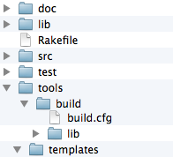

#Directory structure
In order to provide meaningful examples we have to answer the "where do I put this" question and consequently deal with filesystem structure.

Gaudi per default uses a directory structure very closely related to the open source project directory structure:

project source files are saved under src/, documentation under doc/ etc.

Additionally, third party tools are saved under tools/ and the default scaffolding task will copy the Gaudi sources under tools/build/lib.

The following image shows the structure created by the new:project scaffolding task offered by Gaudi:

Following this structure any additions to the build system code should be added under tools/build/lib/custom and Gaudi will include that code automatically.

It is important that custom tasks are added as files in custom/tasks, while supporting code is added in custom/helpers. Helpers are required before any task files so that the code is available to all tasks.
