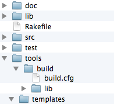

# gaudi-c 

gaudi-c is a [gaudi module](../MODULES.md) aimed at cross-platform, multi-layered, component-based C/C++ code bases.

Like gaudi, it is the code substrate for a series of conventions, only this time specifically geared towards C (and C++, but primarily C)

## Directory structure

In order to provide meaningful examples we have to answer the "where do I put this" question and consequently deal with filesystem structure.

Gaudi per default uses a directory structure very closely related to the open source project directory structure, so with gaudi-c we build on it.

project source files are saved under src/, documentation under doc/, external libraries under lib/ etc.

Additionally, third party tools are saved under tools/ alongside the scaffolded gaudi setup.

The following image shows the structure expected by the gaudi-c gem:

## gaudi-c Class Hierarchy

gaudi-c has a simple view on the structure of a code base.

It consists of Deployments which contain Programs for multiple platforms. Each Program consists of multiple Components. This makes for a very simple class hierarchy with exactly three classes.

These classes map a project's directory structure and its source files. 

All other functionality is within modules and in the overwhelming majority all module methods work as functions, meaning no state is actually modified.

This has some interesting side-effects. Actions tend to apply either to Deployments (deploying via capistrano for example), Components or single files. 

For example linting is the same as compiling, the only thing that changes is the command line. 

This is pretty much generalized for most operations performed by a build system: documentation through doxygen/javadoc/rdoc, any kind of static analysis, unit testing (tests for a deployment, a component or - if you need the granularity - each file). 

Other uses emerge as well, e.g. a Deployment is in a 1-1 relationship with a release package providing the content for said package while you only need a little bit of code to gather metadata such as version, timestamps etc.  

## Configuration

gaudi-c introduces several extensions to the gaudi configuration system. There is a dedicated [manual page](CONFIGURATION.md) for them.

## Usage

Adding deployments, programs etc. also has a [dedicated page](DEV.md)
